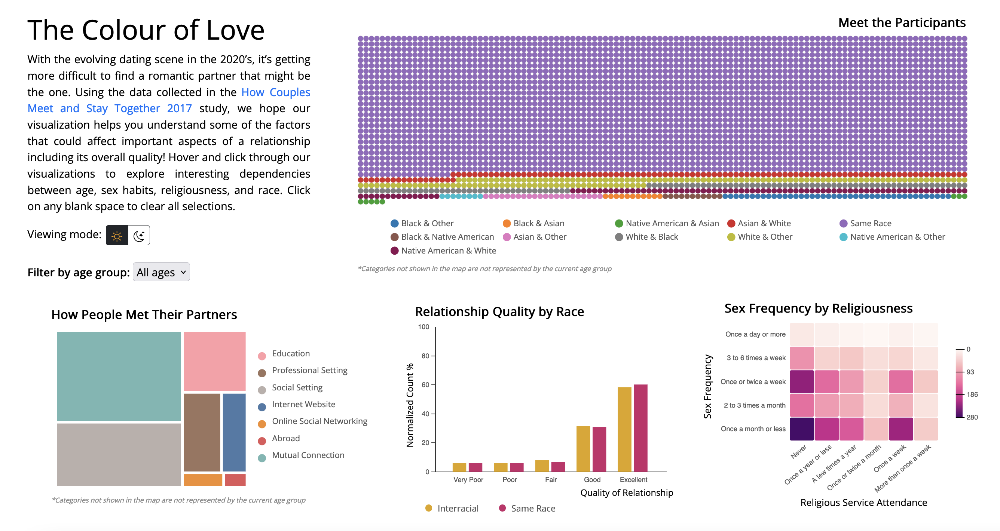

# The Color of Love
Explore the relationships between the race of an individual and their perceived relationship quality. Learn the common places to meet a partner and whether one's religiosity affects their sex life.

## Table of contents
* [Introduction](#introduction)
* [Technologies](#built-with)
* [Demo](#demo)
* [Authors](#authors)

## Introduction 
With the ever-evolving dating scene in the 2020’s, it’s getting more and more difficult to find a partner that might be the one. Using the data collected in the <a href="https://data.stanford.edu/hcmst2017">How Couples Meet and Stay Together 2017</a> study by Stanford researchers, we hope our visualization helps you understand some of the factors that could affect important aspects of a relationship including its overall quality! Hover and click through our visualizations to dive deeper and explore interesting dependencies between age, sex habits, religiousness, and race.

## Built With
* d3
* HTML
* CSS
* JavaScript
* Bootstrap 

## Demo

* [Video walkthrough of dashboard](https://l.messenger.com/l.php?u=https%3A%2F%2Fyoutu.be%2F3dg3KL-Fkkw&h=AT3q_O0OBSdHVfQ7le8_OE73JfmT0qiFz4_l5kfWLmTjW7ppeUGDIvqONIU2tWc9Zi8GngAJl-8qUSTRTNgWCAozP-V2h-UTWh170AlIOUF6HeO0hyQHaDziXkWL51J3yBLsu7nwDqHXBoKygV-rIw)
* Visit UBC CPSC 447's [Hall of Fame](https://www.students.cs.ubc.ca/~cs-447/23Jan/fame/) to access the full report of the project and the demo :crown:

## Authors
Kamsi Oramasionwu, Guramrit Bamrah, Chinenye Oluka
